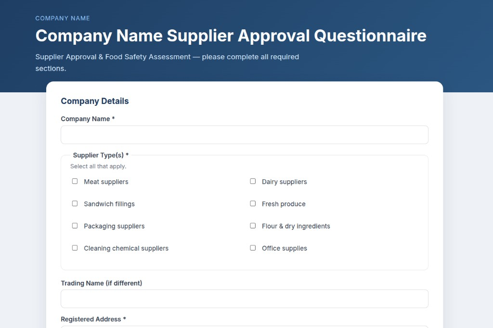
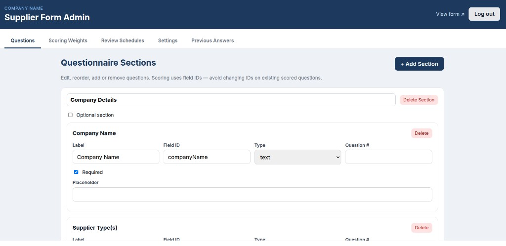

# Supplier Approval Questionnaire

**Version 0.2.0**

Dynamic HACCP supplier approval questionnaire with weighted scoring, PDF reports, Gmail notifications (including calendar reminders), and a password-protected admin panel. **White-label ready** — configure your company name and form branding from the admin Settings tab. Runs on **port 4000** and ships with Docker support.

## Screenshots

### Public supplier form


### Admin panel


## Features

### Public supplier form
- Configurable multi-section questionnaire loaded from `data/app-config.json`
- Multiple supplier types per submission (checkbox list)
- File uploads — PDF, JPG, PNG, WebP (up to 15 files, 10 MB each)
- Automatic weighted risk assessment (500-point scale across 12 categories)
- Honeypot spam protection

### Scoring & review schedules
- 12 weighted scoring categories (Excellent / Good / Satisfactory / Conditional / Not Approved)
- **Review Schedules** by supplier type — admin-configurable (12 / 24 / 36 months)
- Multiple supplier types supported; **shortest review interval wins** (highest risk)
- Next review date calculated from assessment date + schedule

### Email notifications
Each approved submission sends an HTML email to `NOTIFY_EMAIL` containing:
- Full assessment report with scoring matrix
- Complete questionnaire responses
- **PDF assessment report** attachment
- Supplier document attachments
- **`.ics` calendar reminder** for the next review date (with 2-week and 1-week alerts)

### Admin panel (`/admin`)
| Tab | Purpose |
|-----|---------|
| **Questions** | Add, edit, reorder, and delete form sections and fields |
| **Scoring Weights** | Adjust category weights and enable/disable categories |
| **Review Schedules** | Set supplier types and review intervals (12 / 24 / 36 months) |
| **Settings** | Company name, form branding, notification email, assessor name, admin password |
| **Previous Answers** | Browse submissions; download assessment PDF, questionnaire PDF, attachments (ZIP or individual) |

Configuration is persisted in `data/app-config.json`. Submissions and uploads are stored under `data/uploads/{submission-id}/`.

### White-label branding

In **Admin → Settings**, set:

| Field | Where it appears |
|-------|------------------|
| **Company name** | Email headers, PDF reports, calendar reminders, meta description |
| **Logo** | Upload PNG/JPG/WebP in Settings, or paste a public logo URL |
| **Form eyebrow** | Small label above the form title on the public page |
| **Form title / subtitle** | Public questionnaire header |

The supplier declaration (Questions tab) supports a `{companyName}` placeholder — it is replaced automatically when the form is rendered.

**Logo** — upload PNG, JPG, or WebP (max 2 MB) in Admin → Settings, or paste a public HTTPS URL. Uploaded logos take precedence and are embedded in emails and PDFs automatically.

For SMTP, use your own sender name in `.env`:

```env
SMTP_FROM="Your Company <you@gmail.com>"
```

---

## Quick start (development)

```bash
cp .env.example .env
# Edit .env — set SMTP credentials, admin password, session secret

npm install
npm run dev
```

- **Form:** http://localhost:4000  
- **Admin:** http://localhost:4000/admin  

---

## Docker deployment

### 1. Configure environment

```bash
cp .env.example .env
```

Edit `.env` with your SMTP settings, admin password, and a strong `SESSION_SECRET`.

### 2. Build and run

```bash
docker compose up --build -d
```

- **Form:** http://localhost:4000  
- **Admin:** http://localhost:4000/admin  

### 3. View logs

```bash
docker compose logs -f supplier-form
```

### 4. Stop

```bash
docker compose down
```

### Data persistence

The `./data` directory is mounted into the container and holds:
- `data/app-config.json` — admin configuration (questions, scoring, review schedules)
- `data/uploads/` — submission JSON, PDFs, and supplier attachments

**Back up `./data` regularly** for audit and compliance records.

### Production checklist

- [ ] Set a strong `ADMIN_PASSWORD` and `SESSION_SECRET` in `.env`
- [ ] Configure Gmail App Password for `SMTP_PASS`
- [ ] Put a reverse proxy (Caddy / nginx / Traefik) in front for HTTPS
- [ ] Back up the `./data` volume on a schedule
- [ ] Restrict admin access (VPN, IP allowlist, or auth at the proxy)

---

## Gmail SMTP setup

1. Enable **2-Step Verification** on your Google account  
2. Create an **App Password** (Google Account → Security → App passwords)  
3. Set in `.env`:

```env
SMTP_USER=you@gmail.com
SMTP_PASS=your16charapppassword
SMTP_FROM="Your Company <you@gmail.com>"
NOTIFY_EMAIL=you@gmail.com
```

Remove spaces from the app password when pasting into `.env`.

---

## Environment variables

| Variable | Default | Description |
|----------|---------|-------------|
| `HOST` | `0.0.0.0` | Bind address |
| `PORT` | `4000` | Server port |
| `DATA_DIR` | `./data` | Config and data root |
| `UPLOAD_DIR` | `./data/uploads` | Submission file storage |
| `SMTP_HOST` | `smtp.gmail.com` | SMTP server |
| `SMTP_PORT` | `587` | SMTP port |
| `SMTP_SECURE` | `false` | Use TLS directly (true for port 465) |
| `SMTP_USER` | — | Gmail address |
| `SMTP_PASS` | — | Gmail app password |
| `SMTP_FROM` | — | Sender display name and address |
| `NOTIFY_EMAIL` | `SMTP_USER` | Recipient for submission emails |
| `ASSESSOR_NAME` | `David Redrup` | Name shown on assessment reports |
| `ADMIN_PASSWORD` | `changeme` | Admin panel login password |
| `SESSION_SECRET` | — | Cookie signing secret (change in production) |
| `MAX_FILE_SIZE_MB` | `10` | Max size per uploaded file |
| `MAX_FILES` | `15` | Max attachments per submission |

Admin settings (notify email, assessor, form title, review schedules) can also be changed in the admin UI and are saved to `data/app-config.json`.

---

## Project structure

```
├── src/
│   ├── components/       # Dynamic form renderer
│   ├── lib/              # Scoring, email, PDF, config, auth
│   ├── pages/            # Public form, admin UI, API routes
│   └── styles/
├── data/                 # Runtime data (gitignored, Docker volume)
│   ├── app-config.json
│   └── uploads/
├── Dockerfile
├── docker-compose.yml
└── .env.example
```

---

## Scripts

| Command | Description |
|---------|-------------|
| `npm run dev` | Development server on port 4000 |
| `npm run build` | Production build |
| `npm run start` | Run production build locally |
| `npm run preview` | Preview production build |

---

## Git

```bash
git clone https://github.com/five5stones/SupplierForm.git
cd SupplierForm
git checkout v0.2.0   # optional — pin to this release
```

---

## Version history

### 0.2.0
- White-label branding — configurable company name, form title, eyebrow, and subtitle
- `{companyName}` placeholder in supplier declaration text
- Logo via public URL or file upload (PNG/JPG/WebP, max 2 MB)
- Logo appears on public form, admin pages, emails, and PDF reports
- Cache-safe logo updates with versioned URLs

### 0.1.0
- Initial release
- Dynamic supplier questionnaire with admin-configurable questions
- Weighted 12-category scoring engine
- Supplier type review schedules (multi-select, shortest interval applies)
- PDF assessment and questionnaire reports
- Email notifications with calendar (`.ics`) reminders
- Admin panel with submission downloads (PDF, ZIP attachments)
- Docker and docker-compose support

---

## Licence

Private — internal use.
